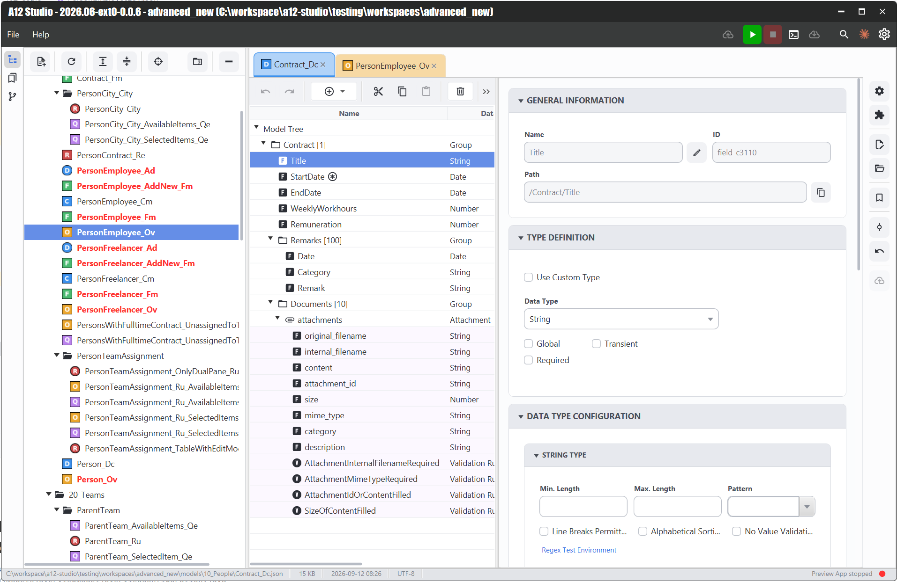
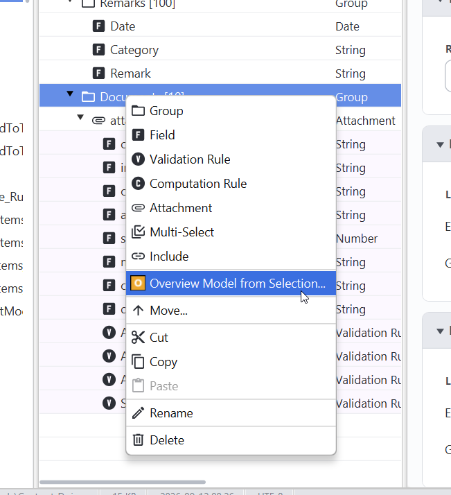
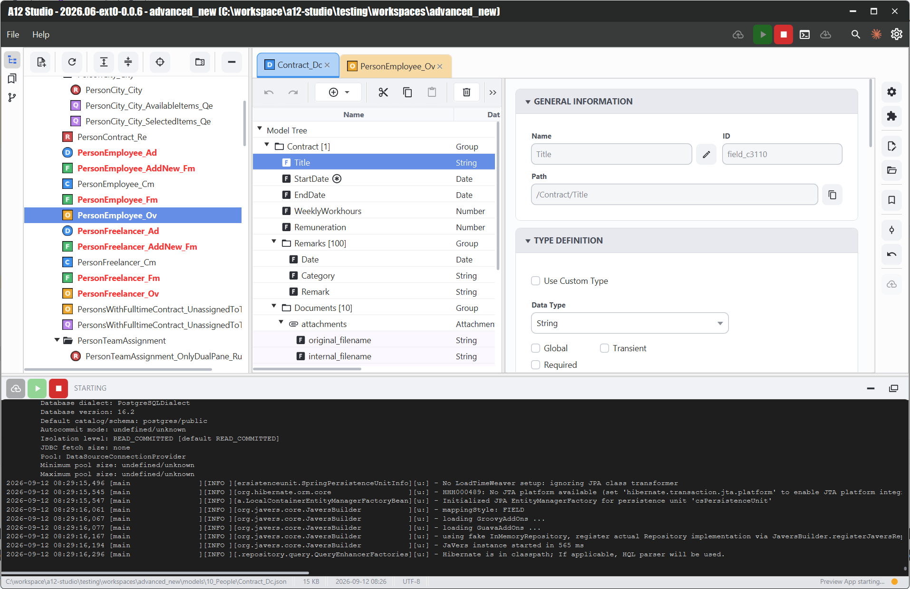
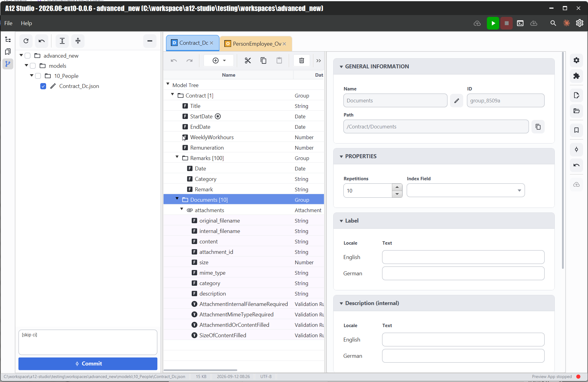
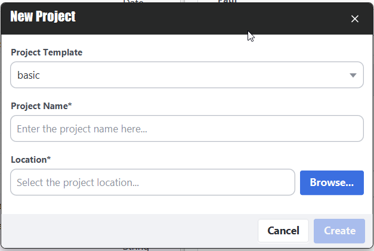
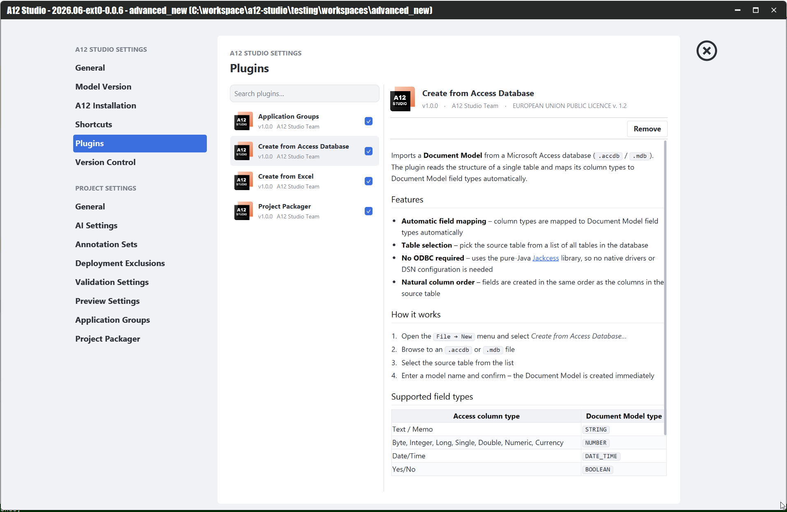

# A12 Studio

This project is an alternative editor for A12 models (https://geta12.com/#/getting-started).

> The project has an alpha status and is not intended for production use!!!
>
> The project only supports A12 with version 2026.06.

### What it offers

- Full accessibility (key navigation, shortcuts, screen-reader support, ...)
- Localization for the languages: English, German
- Integrated preview app control — start/stop the A12 preview app and follow its live log output from a docked console, without leaving the editor
- Built-in version control support — stage, review and commit workspace changes from a Git-style panel next to the project tree
- Project templates — bootstrap a new project from a template via the New Project dialog instead of assembling the folder structure by hand
- An extensible plugin system with a built-in marketplace, bundled with several ready-to-use plugins:
  - **Application Groups** — multi A12 application project support
  - **Create from Access Database** — generates a Document Model from a Microsoft Access table (`.accdb`/`.mdb`), with automatic column-to-field-type mapping and no ODBC/native driver required
  - **Create from Excel** — generates a Document Model from an Excel sheet
  - **Project Packager** — auto packaging of models for deployment
- Rich, context-menu-driven modelling: add Groups, Fields, Validation Rules, Computation Rules, Attachments, Multi-Selects and Includes, or derive an Overview Model directly from a selection
- Advanced editing options:
  - DocumentModel creation wizards
  - Annotation dataset import and export
  - Auto packaging of models
  - ...

### What it does NOT offer

- Migration support
- Runtime model export
- An embedded live preview (the preview app runs and is controlled externally; its output is surfaced via the console panel, not rendered inside the editor)

## Screenshots

**Document Model editing** — model tree, field list and property panel side by side.

**Context-menu driven modelling support** — add groups, fields, rules, attachments and more, or generate an Overview Model from a selection.

**Integrated preview app control** — start, stop and watch the A12 preview app's log output without leaving the editor.

**Built-in version control support** — review and commit workspace changes from a Git-style panel.

**Project templates** — start a new project from a template.

**Plugin system & marketplace** — manage bundled and installed plugins from the preferences dialog.

## Modelling

This project is under development.
You find an up-to-date overview about all supported model types and their status below.

**All checked models here are still under development!!!**

| Model Type | Status |
| --- | --- |
| Additive Document Model | [x] |
| Application Model | [x] |
| Combined Document Model | [x] |
| Content Model | [x] |
| Document Model | [x] |
| Form Model | [x] |
| Mapping Model | Not supported yet |
| Master-Detail Model | [x] |
| Overview Model | [x] |
| Print Model | Not supported yet |
| Print Typesetting Model | Not supported yet |
| Query Model | [x] |
| Relationship Model | [x] |
| Relationship UI Model | [x] |
| Selection Model | Not supported yet |
| Structural Mapping Model | Not supported yet |
| Tree Model | [x] |
| Type Definition Model | [x] |

## Q&A

Please open a ticket at https://github.com/syd711/a12-studio/issues for questions, issues and feature requests.
